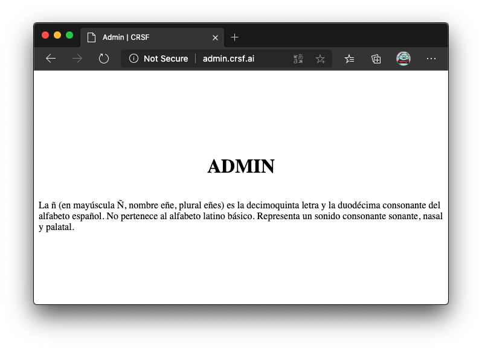

<style>
.is-flex-center {
  display:flex;
  justify-content:center;
  align-items:center;
}
.is-column {
  flex-direction:column;
}
</style>
<div class="is-flex-center is-column">
  <h1>Examen AS</h1>
  <h2><span>Author: </span>Carlos Rodrigo Sanabria Flores</h2>
</div>
<div class="page"></div>

## Configuración Inicial

```rb
Vagrant.configure("2") do |config|
  config.vm.box = "ubuntu/bionic64"

  config.vm.define "vm1" do |vm1|
    vm1.vm.hostname = "vm1"
    vm1.vm.network "private_network", ip: "192.168.22.22"
    vm1.vm.provider "virtualbox" do |vb|
      vb.name = "vm1"
      vb.memory = 512
      vb.cpus = 1
      vb.gui = false
    end
    vm1.vm.provision "shell", inline: <<-SHELL
      apt-get update
    SHELL
  end

  config.vm.define "vm2" do |vm2|
    vm2.vm.hostname = "vm2"
    vm2.vm.network "private_network", ip: "192.168.22.23"
    vm2.vm.provider "virtualbox" do |vb|
      vb.name = "vm2"
      vb.memory = 512
      vb.cpus = 1
      vb.gui = false
    end
    vm2.vm.provision "shell", inline: <<-SHELL
      apt-get update
    SHELL
  end

  config.vm.define "vm3" do |vm3|
    vm3.vm.hostname = "vm3"
    vm3.vm.network "private_network", ip: "192.168.22.24"
    vm3.vm.provider "virtualbox" do |vb|
      vb.name = "vm3"
      vb.memory = 512
      vb.cpus = 1
      vb.gui = false
    end
    vm3.vm.provision "shell", inline: <<-SHELL
      apt-get update
    SHELL
  end

  config.vm.define "vm4" do |vm4|
    vm4.vm.hostname = "vm4"
    vm4.vm.network "private_network", ip: "192.168.22.25"
    vm4.vm.provider "virtualbox" do |vb|
      vb.name = "vm4"
      vb.memory = 512
      vb.cpus = 1
      vb.gui = false
    end
    vm4.vm.provision "shell", inline: <<-SHELL
      apt-get update
    SHELL
  end
end
```

### Iniciando la maquina vm1


## Cortafuegos

### HTTP


### HTTPS


### SSH


### Orden de Reglas


## Apache

## Intalación

Siguiendo los requisitos necesitamos instalar los siguientes elementos

```sh
sudo apt-get install -y apache2 php libapache2-mod-php
```

## Direcctorios

Ahora debemos crear los directorios que deseamos utilizar

```sh
sudo mkdir -p /var/www/{crsf{,/src},admin,test}
```
### Ficheros de configuración

Creamos los siguientes ficheros en la ruta `/etc/apache2/sites-available/$NOMBRE`

### www.crsf.ai.conf

```conf
<VirtualHost 192.168.22.22:80>
  ServerAdmin crsf@crsf.ai
  ServerName www.crsf.ai
  DocumentRoot /var/www/crsf
  ErrorLog ${APACHE_LOG_DIR}/error_crsf.log
  CustomLog ${APACHE_LOG_DIR}/error_crsf.log combined

  <Directory /var/www/crsf>
    Options -Indexes
    <IfModule mod_rewrite.c>
      RewriteEngine On
      RewriteCond %{REQUEST_FILENAME} !-f
      RewriteCond %{REQUEST_FILENAME} !-d
      RewriteRule ^/?catalogo/(.*?)/?$ /prodList.php?id=$1 [L]
    </IfModule>
  </Directory>

  <Directory /var/www/crsf/src>
    Options +Indexes
  </Directory>
</VirtualHost>
```

### test.crsf.ai.conf

```conf
<VirtualHost 192.168.22.22:80>
  ServerAdmin test@crsf.ai
  ServerName test.crsf.ai
  DocumentRoot /var/www/test
  ErrorLog ${APACHE_LOG_DIR}/error_crsf_test.log
  CustomLog ${APACHE_LOG_DIR}/error_crsf_test.log combined

  <Directory /var/www/test>
    Options -Indexes
  </Directory>
</VirtualHost>
```

### admin.crsf.ai.conf

```conf
<VirtualHost 192.168.22.22:80>
  ServerAdmin admin@crsf.ai
  ServerName admin.crsf.ai
  DocumentRoot /var/www/admin
  ErrorLog ${APACHE_LOG_DIR}/error_crsf_admin.log
  CustomLog ${APACHE_LOG_DIR}/error_crsf_admin.log combined

  <Directory /var/www/admin>
    Options -Indexes
  </Directory>
</VirtualHost>
```

### Fichero Index

Añadimos el siguiente fichero html en la ruta `/var/www/$NOMBRE/index.html`

Donde `$NOMBRE` puede ser `crsf`, `admin`, `test`

```html
<!DOCTYPE html>
  <html lang="en">
  <head>
    <!--<meta charset="UTF-8">-->
    <meta name="viewport" content="width=device-width, initial-scale=1.0">
    <title>CRSF</title>
  </head>
  <body style="min-height:100vh;display:flex;justify-content:center;align-items:center;flex-direction:column;">
  <h1>CRSF</h1>
  <p>La ñ (en mayúscula Ñ, nombre eñe, plural eñes) es la decimoquinta letra y la duodécima consonante del alfabeto español. No pertenece al alfabeto latino básico. Representa un sonido consonante sonante, nasal y palatal.</p>
  </body>
  </html>
```

### Fichero prodList.php

Creamos el siguente fichero en la ruta `/var/www/crsf/prodList.php` en la que se mustra el parametro `$_GET["id"]`

```php
<!DOCTYPE html>
<html lang="en">
  <head>
    <meta charset="UTF-8">
    <meta name="viewport" content="width=device-width, initial-scale=1.0">
    <title>Catalogo</title>
  </head>
  <body style="min-height:100vh;display:flex;justify-content:center;align-items:center;flex-direction:column;">
    <h1>Producto</h1>
    <h2><?= $_GET["id"] ?></h2>
  </body>
</html>
```

para redirgir de la ruta `www.crsf.ai/prodList.php?id=001` a `www.csrf.ai/catalogo/0001`

añadimos la siguentes lineas en el fichero de configuración `www.crsf.ai.conf`

```
<IfModule mod_rewrite.c>
  RewriteEngine On
  RewriteCond %{REQUEST_FILENAME} !-f
  RewriteCond %{REQUEST_FILENAME} !-d
  RewriteRule ^/?catalogo/(.*?)/?$ /prodList.php?id=$1 [L]
</IfModule>
```

## Activar UTF-8 para tildes

Descomentamos la linea `AddDefaultCharset UTF-8` para activar `UTF-8`

```sh
sed -i '/AddDefaultCharset UTF-8/s/^#//g' /etc/apache2/conf-available/charset.conf
```

> Para que los cambios se apliquen se debe reiniciar apache

### Finalmente

Desactivamos el sitio por defecto

```
sudo a2dissite 000-default.conf
```

Activamos nuestros sitios

```
sudo a2ensite {www,test,admin}.crsf.ai.conf
```

Activamos el modulo rewrite

```
sudo a2enmod rewrite
```

Finalmente reiniciamos el apache

```
sudo systemctl reload apache2
```

## Capturas Navegador

### Pagina Principal


### Indexado carpeta src


### Pagina Catalogo


### Pagina Test


### Pagina Admin



## Apache Avanzado

### Añadimos las maquinas los alias en `/etc/hosts`

```sh
sudo echo -e "192.168.22.23 node01\n192.168.22.24 node02\n192.168.22.25 node03" >> /etc/hosts
```

### Añadimos las configuraciones para el balanceador de carga


