# Practica 2
## Integrantes
Felix Rodriguez Pericacho
Carlos Rodrigo Sanabria Flores

## Instalación de máquinas virtuales mediante Vagrant.

```sh
$script = <<-SHELL
  apt-get update
  apt-get install -y nmap
  echo "192.168.2.101 vm1\n192.168.2.102 vm2\n192.168.2.103 vm3" >> /etc/hosts
SHELL

Vagrant.configure("2") do |config|
  config.vm.box = "ubuntu/bionic64"
  config.vm.provision "shell", inline: $script
  (1..3).each do |i|
    config.vm.define "vm#{i}" do |node|
      node.vm.hostname = "vm#{i}"
      node.vm.network "private_network", ip: "192.168.2.10#{i}"
      node.vm.provider "virtualbox" do |vb|
        vb.name = "vm#{i}"
        vb.memory = 512
        vb.cpus = 1
        vb.gui = false
      end
    end
  end
end
```
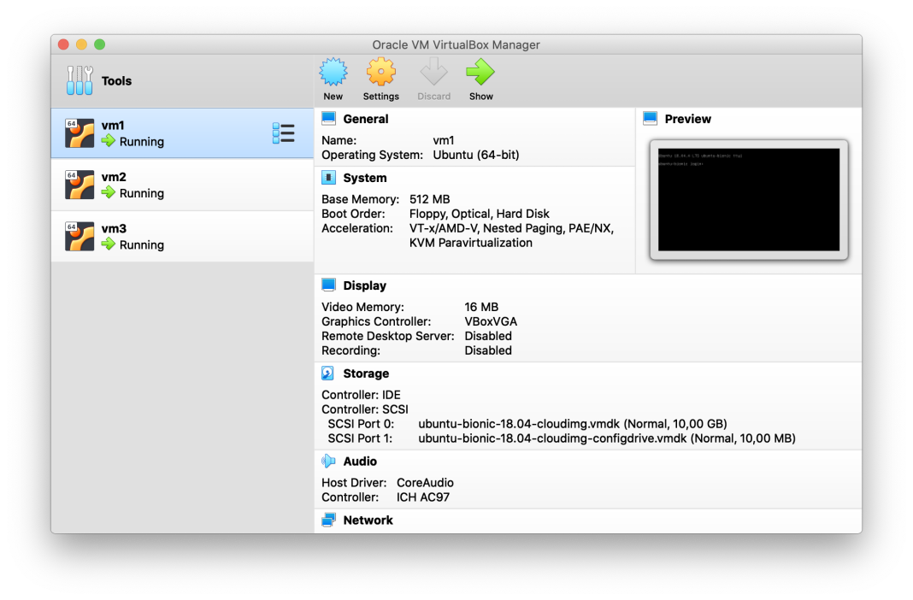

## Visibilidad de las máquinas 

```sh
echo "192.168.2.101 vm1\n192.168.2.102 vm2\n192.168.2.103 vm3" >> /etc/hosts
```
Veasé también en la linea 4 del Vagrantfile

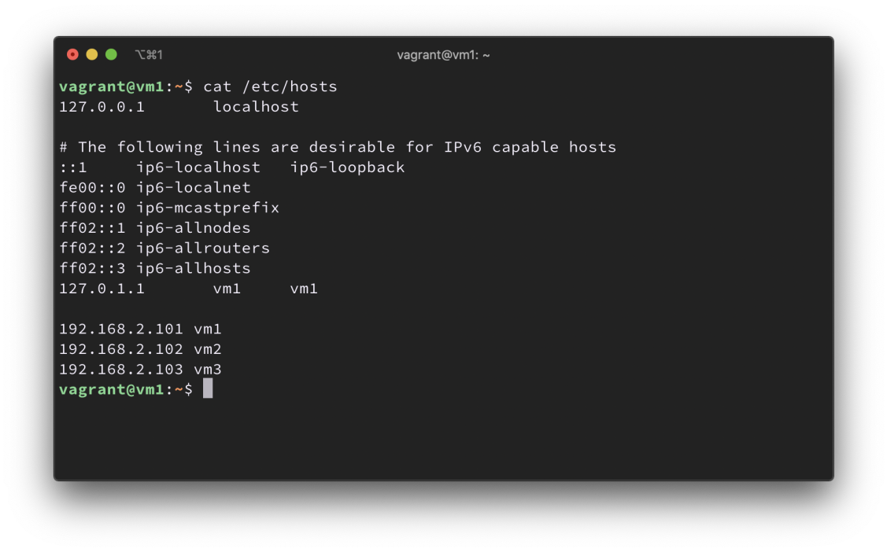

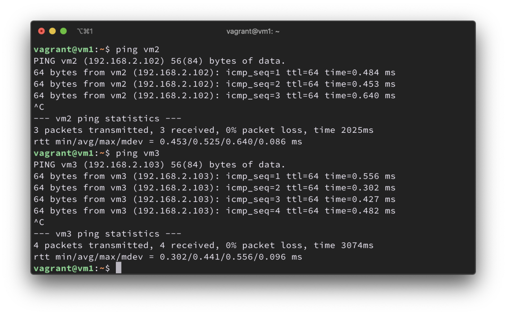

## Desde VM2 comprobar los puertos que VM1 tiene abiertos.

```sh
nmap -p- vm1
```

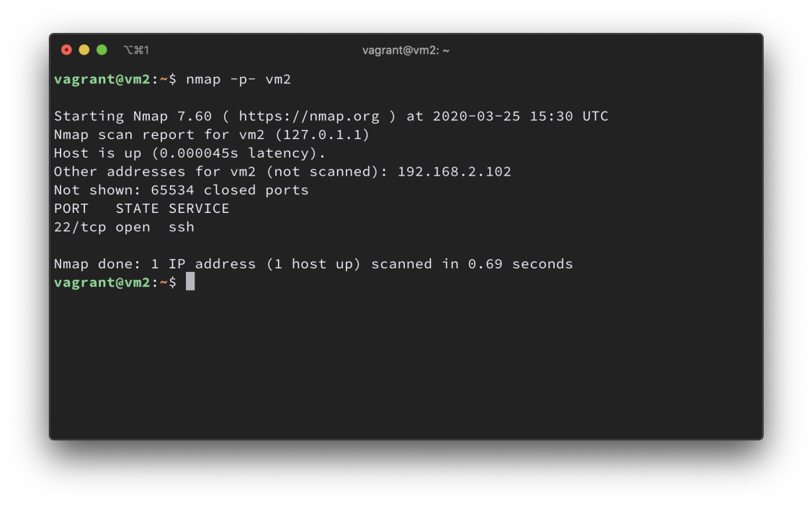

## Prohibir el acceso por ssh

```sh
sudo iptables -A INPUT -p tcp --dport 22 -j DROP
```

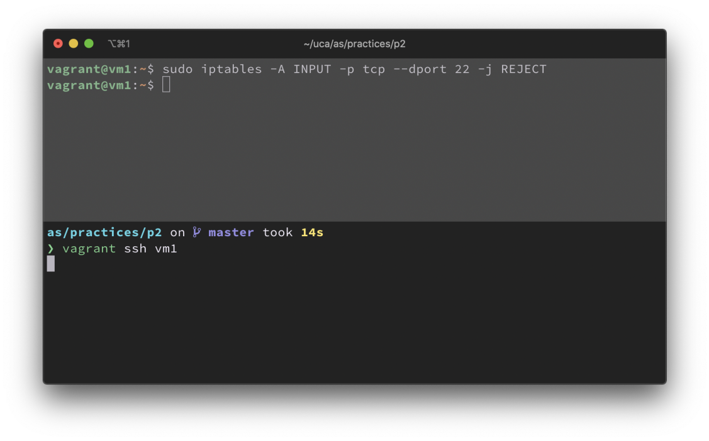

### ¿Qué ha pasado?

La consola ha dejado de funcionar debido a que se ha bloqueado la conexión por ssh

### ¿Puedo crear una nueva conexión?

No se puede crear

### ¿La consola sigue funcionando?

No sigue funcionando

## Configuración minima

```sh
sudo iptables -A INPUT -i lo -j ACCEPT
sudo iptables -A INPUT -m state --state ESTABLISHED -j ACCEPT
sudo iptables -P INPUT DROP
```

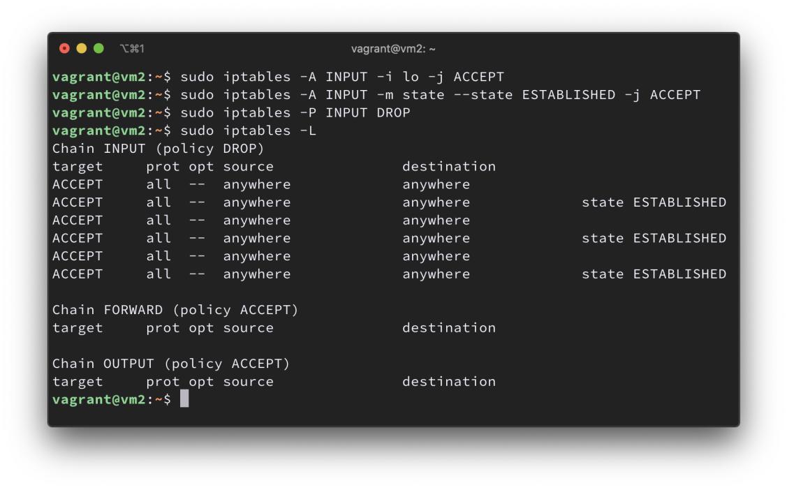

## Servidor HTTP/S

```sh
sudo iptables -A INPUT -m state --state NEW -p tcp --dport 80 -j ACCEPT
sudo iptables -A INPUT -m state --state NEW -p tcp --dport 443 -j ACCEPT
```
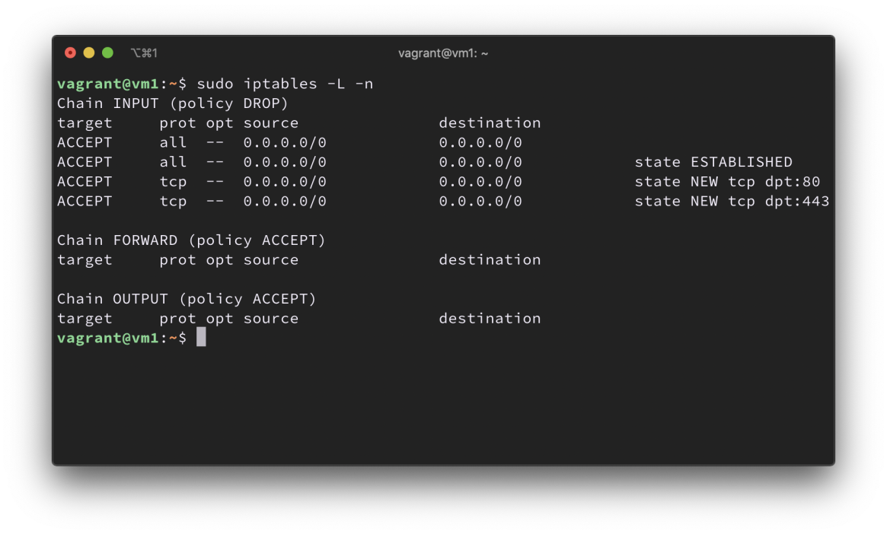

## Servidor FTP

```sh
sudo iptables -I OUTPUT -p tcp -d 192.168.2.102 --dport 20 -j ACCEPT
sudo iptables -I OUTPUT -p tcp -d 192.168.2.102 --dport 21 -j ACCEPT
sudo iptables -I INPUT -p tcp -s 192.168.2.102 --dport 20 -j ACCEPT
sudo iptables -I INPUT -p tcp -s 192.168.2.102 --dport 21 -j ACCEPT
```
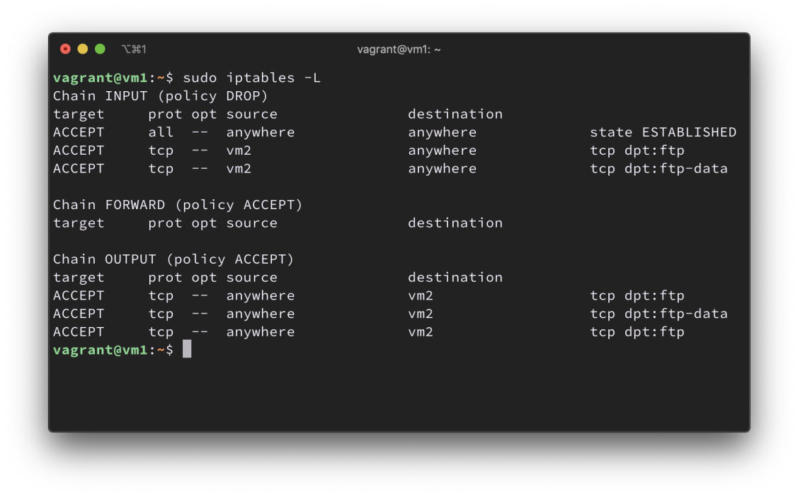
## Servidor MySQL


```sh
sudo iptables -A INPUT -i lo -p tcp -s vm1 --dport 3306 -j ACCEPT
```
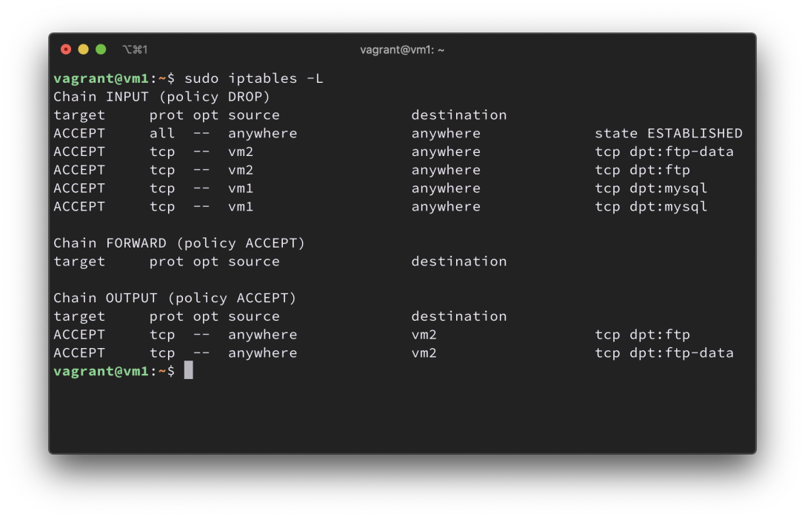
## Poniendo excepciones 


```sh
sudo iptables -A INPUT -p tcp -s vm2 --dport 1:1000 -j ACCEPT
sudo iptables -A INPUT -p tcp -s vm3 --dport 1:1000 -j ACCEPT
sudo iptables -A INPUT -p udp -s vm2 --dport 1:1000 -j ACCEPT
sudo iptables -A INPUT -p udp -s vm3 --dport 1:1000 -j ACCEPT
```
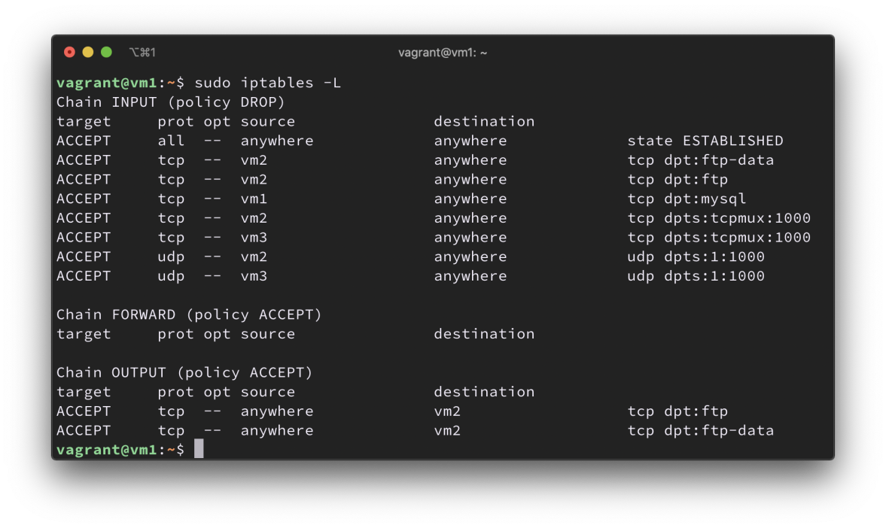
## UFW 


```sh
sudo ufw allow http
sudo ufw allow https
sudo ufw allow from 192.168.2.102 to any port 20
sudo ufw allow from 192.168.2.102 to any port 21
sudo ufw allow from 127.0.0.1 to any port 3306
sudo ufw deny 3306
```
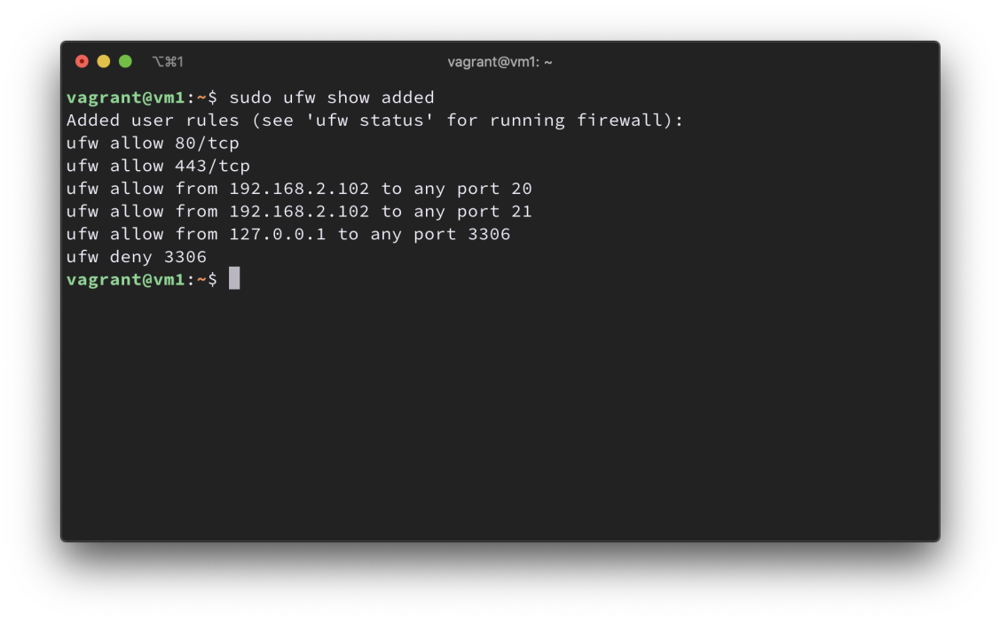
