## Autores:
    Felix Rodriguez Pericacho

    Carlos Rodrigo Sanabria Flores
## Instalación de máquinas virtuales mediante Vagrant
### Crear el entorno de red mediante un único fichero Vagrant.
```rb
$script = <<-SHELL
   apt-get update
   apt-get install -y traceroute
   #Permitir ssh con contraseña
   sed -i -e "s/PasswordAuthentication no/PasswordAuthentication yes/g" /etc/ssh/sshd_config
   systemctl restart ssh
SHELL

Vagrant.configure("2") do |config|
   config.vm.box = "ubuntu/bionic64"
   config.vm.provision "shell", inline: $script

	  config.vm.define "router" do |node|
	  	node.vm.hostname = "router"
		node.vm.network "private_network", ip: "192.168.2.1"
		node.vm.network "private_network", ip: "192.168.3.1"
		node.vm.provider "virtualbox" do |vb|
			vb.name = "router"
		    vb.memory = 512
		    vb.cpus = 1
		    vb.gui = false
	  	end
	  end
   
      config.vm.define "vm1" do |node|
         node.vm.hostname = "vm1"
         node.vm.network "private_network", ip: "192.168.2.2"
		 node.vm.provider "virtualbox" do |vb|
            vb.name = "vm1"
            vb.memory = 512
            vb.cpus = 1
            vb.gui = false
         end
      end
      
      config.vm.define "vm2" do |node|
         node.vm.hostname = "vm2"
         node.vm.network "private_network", ip: "192.168.3.2"
         node.vm.provider "virtualbox" do |vb|
            vb.name = "vm2"
            vb.memory = 512
            vb.cpus = 1
            vb.gui = false
         end
      end
end
```
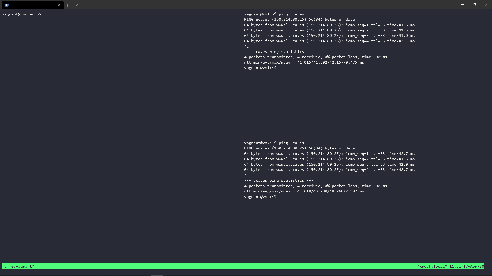
### Configurar el cortafuegos para que de acceso al exterior.
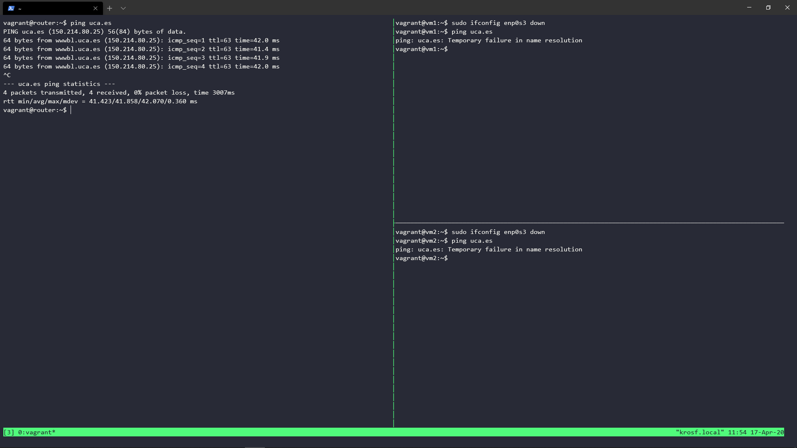
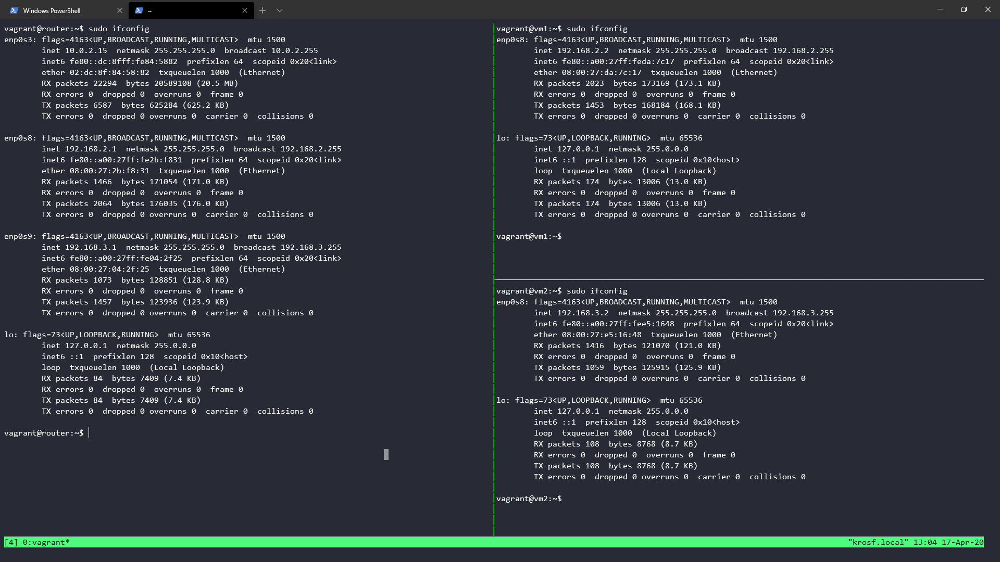
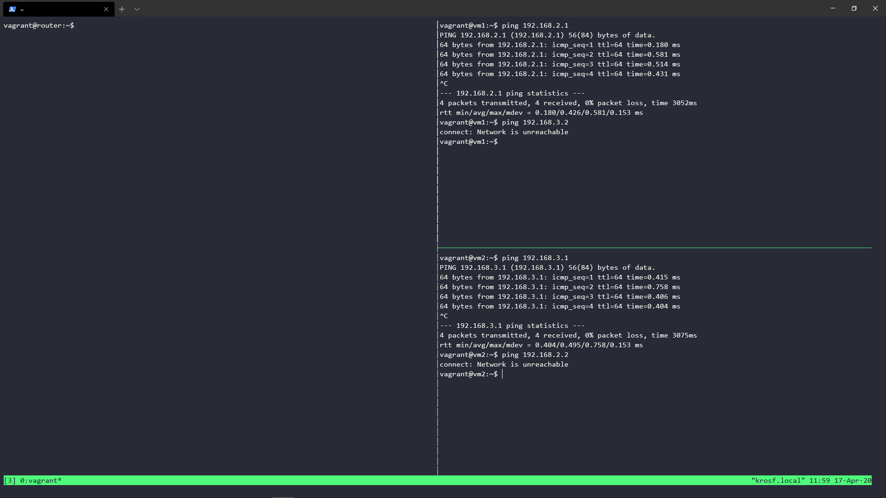
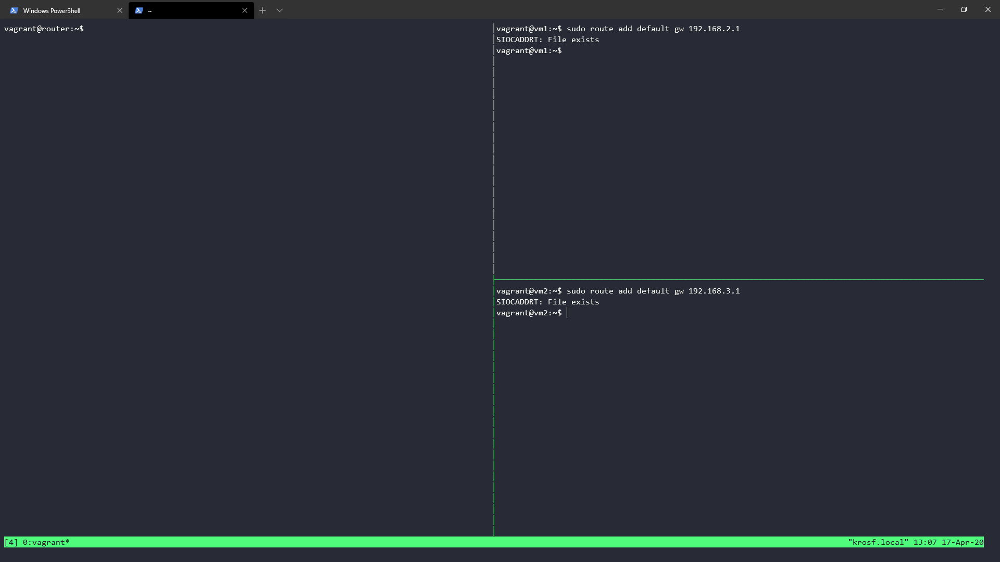
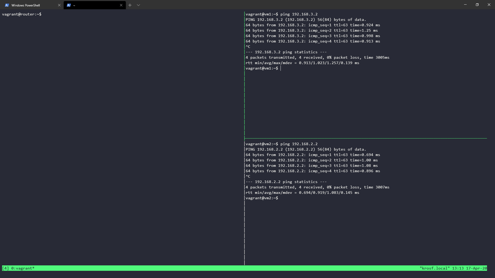
### Configurar manualmente los clientes de las redes para que se puedan conectar al servidor.
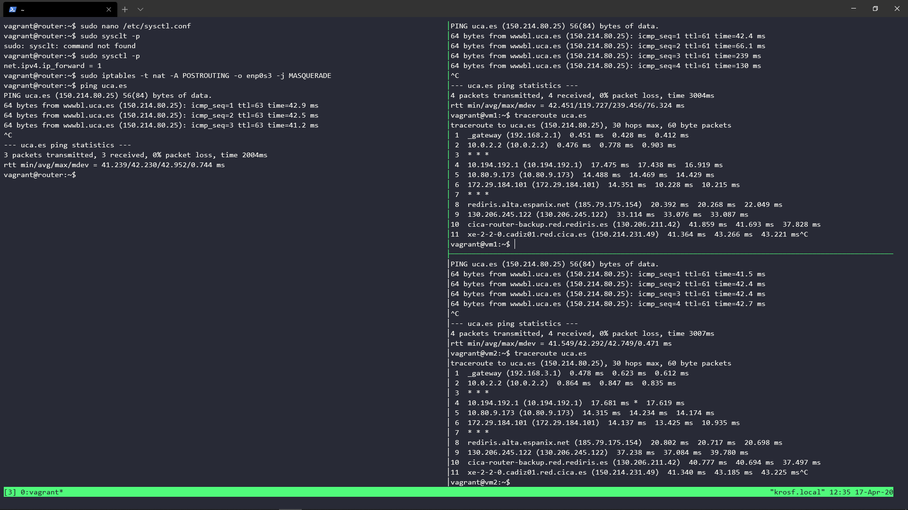

## Servidor DHCP 

### Asignacion de Redes
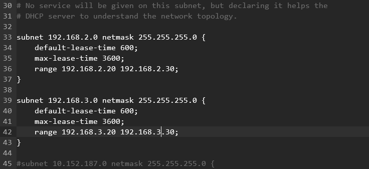

### Configuración del Servidor
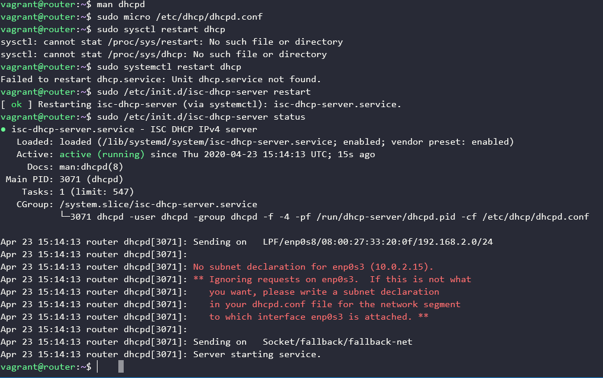

Primero configuramos el dhcpd.conf, a continuación bastaria con reiniciar el servidor y hacer un status para comprobar que funciona.

Para comprobar que el servidor asigna correctamente las IPs hacemos lo siguiente:

```sh
cat /var/lib/dhcp/dhcpd.leases
```
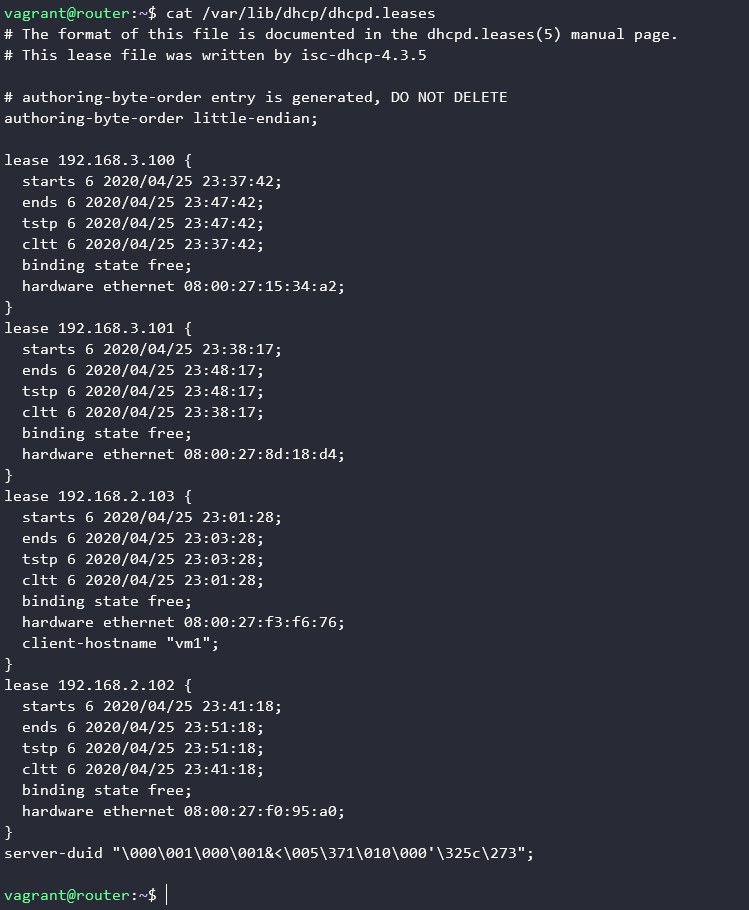

## Servidor DNS 

### Creacion del fichero de zona


A continuacion configuramos la zona:

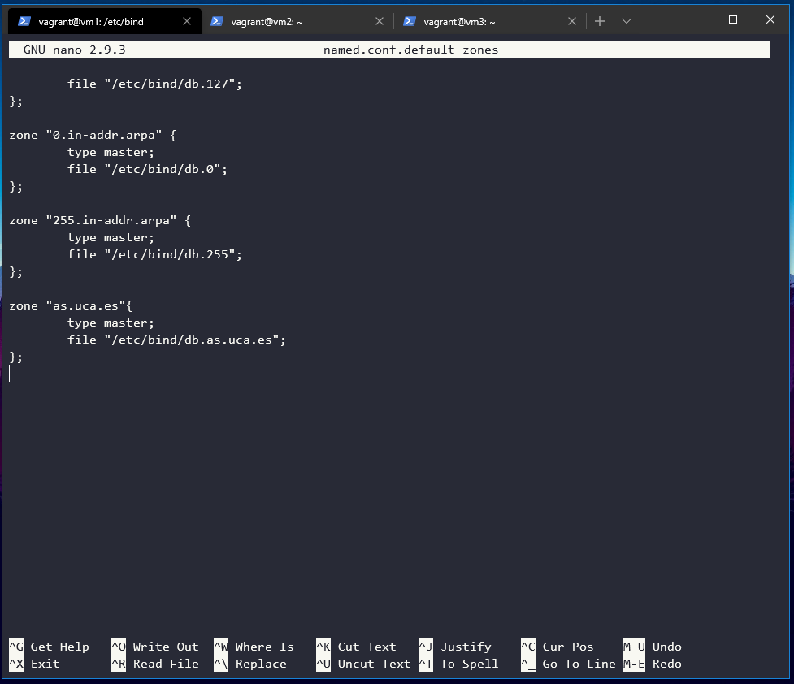

Ahora pasamos a configurar los records de nuestro servidor:

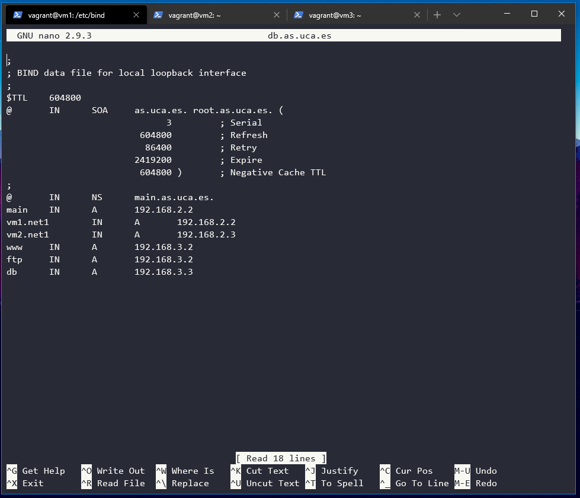

Reiniciamos el servidor y comprobamos que funciona haciendo un status:

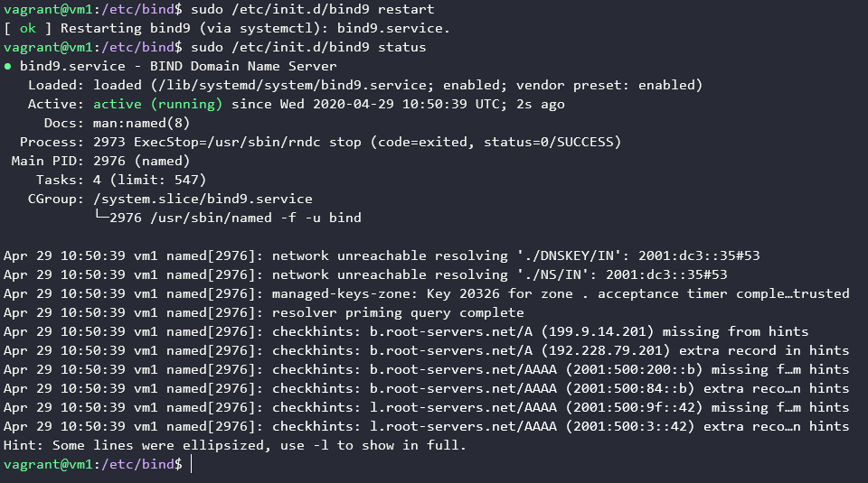

### Configuracion del cliente

Modificamos el archivo resolve.conf para que use el servidor creado:

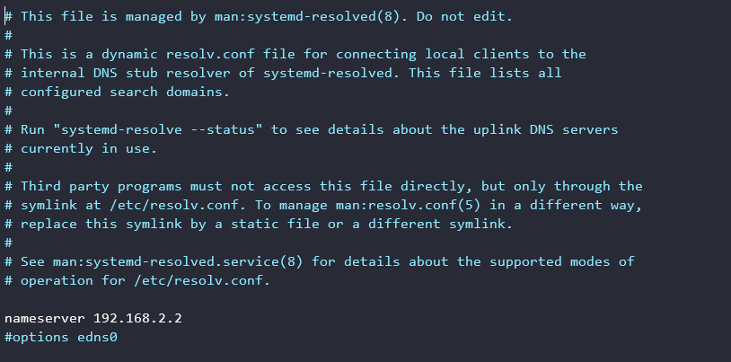

A continuacion comprobamos que funciona haciendo distintos pings:

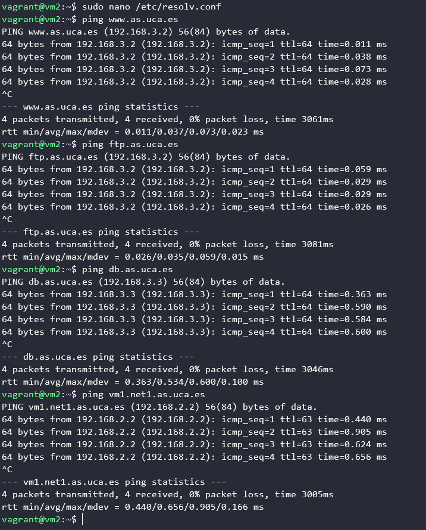

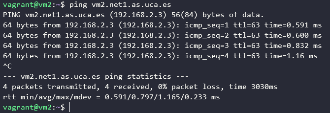