## Autores:
   * Felix Rodriguez Pericacho
   * Carlos Rodrigo Sanabria Flores

## Instalación de la máquina 

Mediante el Vagrantfile iniciaremos la maquina, con su ip privada (192.168.10.2), con apache y php ya instalado:

```rb
Vagrant.configure("2") do |config|
  config.vm.box = "ubuntu/bionic64"
  config.vm.network "private_network", ip: "192.168.10.2"

  config.vm.provision "shell", inline: <<-SHELL
    apt-get update
    apt-get install -y apache2 libapache2-mod-php php apache2-utils
  SHELL
end
```
## Configuración básica de apache 

### manolorg.uca.es

Primero creamos el /var/www/manolorg.

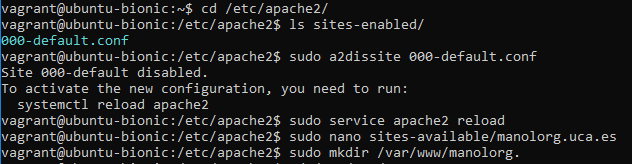

A continuacion configuramos manolorg.uca.es.conf

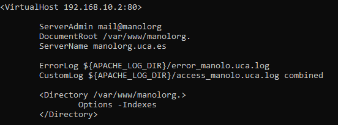

### manolorg.uca.es/docs

Creamos la dirección /docs mediante:

```rb
sudo mkdir docs
```

A continuacion volvemos a configurar manolorg.uca.es.conf:

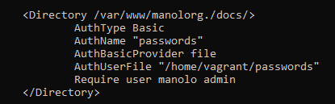

### manolorg.uca.es/software

Creamos la dirección /software mediante:

```rb
sudo mkdir software
```

A continuacion volvemos a configurar manolorg.uca.es.conf:

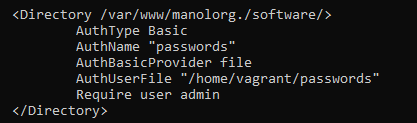

### manolorg.uca.es/sci2s

Creamos la dirección /sci2s mediante:

```rb
sudo mkdir sci2s
```

A continuacion volvemos a configurar manolorg.uca.es.conf:

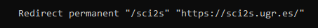

### /var/www/lab1

```rb
sudo mkdir /var/www/lab1
```

A continuacion configuramos lab1.manolorg.conf:

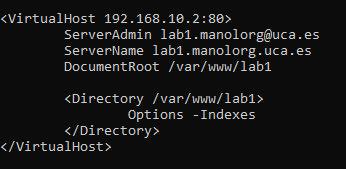

Y activamos lab1.manolorg mediante:

```rb
sudo a2ensite lab1.manolorg.conf
```

### /var/www/lab2

```rb
sudo mkdir /var/www/lab2
```

A continuacion configuramos lab2.manolorg.conf:

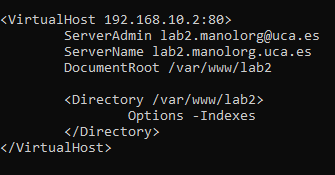

Y activamos lab2.manolorg mediante:

```rb
sudo a2ensite lab2.manolorg.conf
```

Dejandonos con la siguiente web:

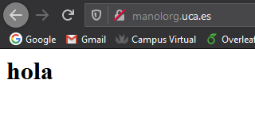
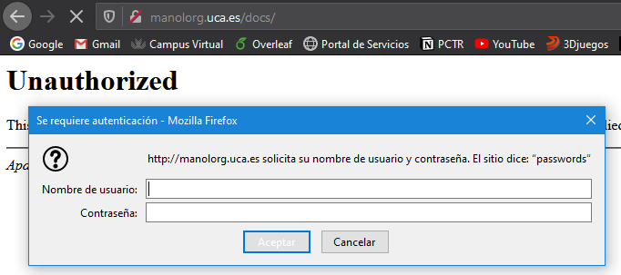
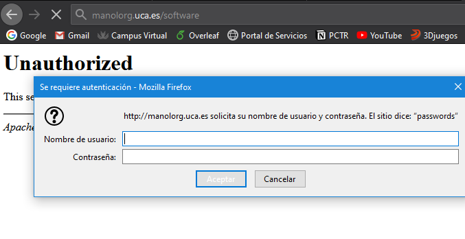

## Caché

Primero descargamos una imagen en la maquina mediante:

```rb
sudo curl -LO https://raw.githubusercontent.com/krosf-university/as/master/practices/p4/img/Captura.PNG
```

A continuacion en la web podemos ver que la imagen proviene de la caché al inspeccionar las propiedades de esta:

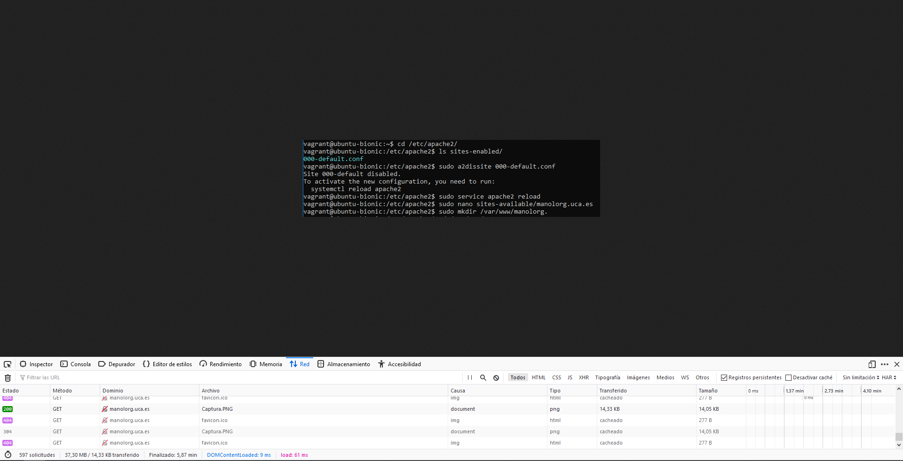

A continuacion podemos ver con mas detalle cuando la imagen a sido cacheada y cuando no:

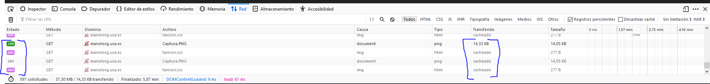

## Redirección

### JPEG

Pasamos a reconfigurar el archivo manolorg.conf para que cuando se le pida buscar un archivo jpeg busque uno jpg:

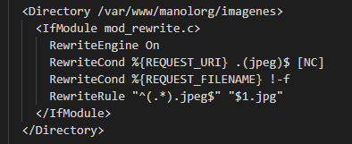

### Condicion JPEG

Como podemos ver en la imagen anterior mediante el flag 

```rb
      RewriteCond %{REQUEST_FILENAME} !-f
```

Podemos cumplir la condicion para que solo rediriga si el jpeg no existe.

### Redireccion PHP

Para redirigir hasta personalWeb.php?user=CoboMJ debemos modificar el archivo manolorg.conf añadiendo las siguientes reglas:

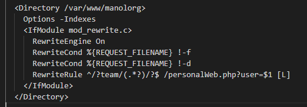

Y aqui un ejemplo de como capturar los parametros $_GET en php:

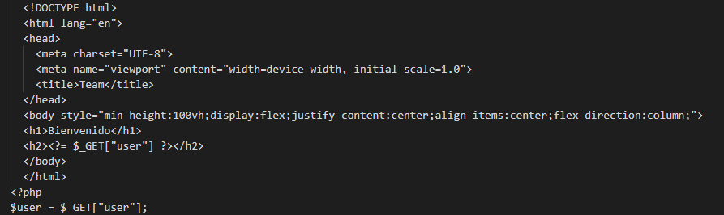

## Balanceo de carga

Primero creamos las maquinas que necesitamos con su index.html para comprobar que se esta utilizando dicha maquina, y a continuacion configuramos el balanceo de carga:

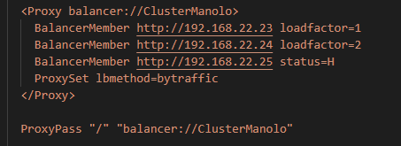

Una vez configurado podemos comprobar el rendimiento que obtenemos con y sin el balanceo de carga:

Sin balanceo de carga:

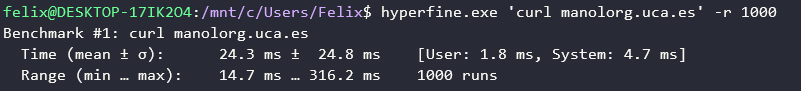

Con balanceo de carga:

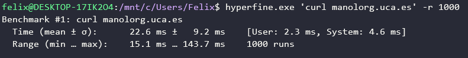

Como podemos apreciar es mas eficiente el uso del balanceo de carga.